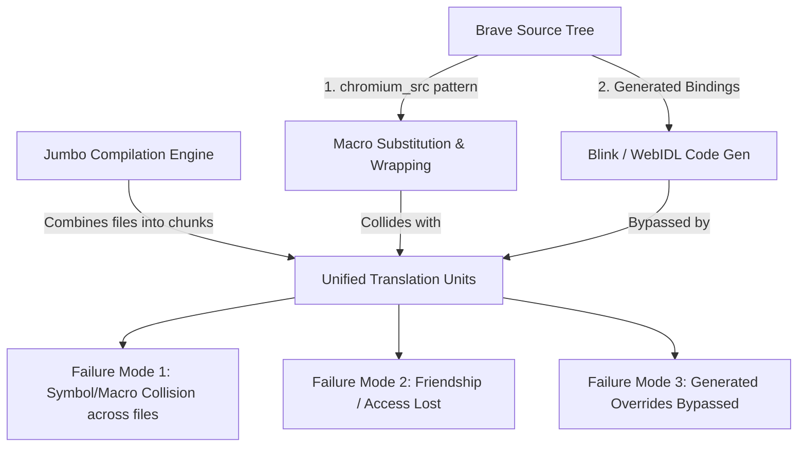

# Brave Browser for Termux ARM64: Build Report & Upgrade Guide

## 1. Executive Summary

This report documents the end-to-end process of successfully compiling **Brave Browser** (`v149.0.7827.155-1`) for **Termux ARM64** (`aarch64-linux-android24`). 

The build completed all 5 compilation phases (spanning **35,764 total targets** and **22,687 C++ compilation units** in Phase 5) and produced the final binary distribution:
- **Output Artifact**: [`output/brave-browser_149.0.7827.155-1_aarch64.deb`](file:///home/emilio/Documents/brave-termux/output/brave-browser_149.0.7827.155-1_aarch64.deb)
- **Compressed Size**: `193 MB`
- **Installed Size**: `~808 MB`
- **Key Executables Included**: `brave`, `brave-launcher.sh`, `chromedriver`, `headless_shell`, `chrome_crashpad_handler`.

---

## 2. Complete Catalog of Changes Made

During the build process, several categories of errors were identified and resolved. Below is an exhaustive catalogue of every fix applied to `build.sh`, patch files, and the build system.

### A. Pre-configuration & Asset Generation
| File | Problem | Solution Applied |
| :--- | :--- | :--- |
| `termux_step_pre_configure` in [build.sh](file:///home/emilio/Documents/brave-termux/packages/brave-browser/build.sh) | Build failed due to missing 12 desktop-specific locales (e.g., `af`, `az`, `be`, `es-419`) in `locale_settings_linux.grd`. | Executed `npx tsx $TERMUX_PKG_SRCDIR/brave/build/commands/scripts/branding.js --update` to generate desktop resources and sync `.grd` locale files before running GN. |
| `brave/chromium_src/tools/json_schema_compiler/feature_compiler.py` | Out-of-tree build directory caused `assert source_file.startswith("../../")` to fail. | Updated path normalization using `os.path.relpath(os.path.abspath(source_file), src_root)` to support arbitrary build directories. |

### B. LLVM / Libc++ 21 Strictness Fixes
| File | Problem | Solution Applied |
| :--- | :--- | :--- |
| `brave/components/tor/tor_control.h` | LLVM libc++ 21 relocatability checks require complete types when instantiating `std::queue<std::pair<...>>`. Including only `callback_forward.h` left `base::OnceCallback` incomplete. | Replaced `#include "base/functional/callback_forward.h"` with `#include "base/functional/callback.h"`. |
| `brave/browser/resources/settings/brave_tor_page/brave_tor_subpage.ts` | TypeScript compile error on `window.testing.torSubpage`. | Added cast `const win = window as any; win.testing.torSubpage`. |

### C. Jumbo Name Collisions & Anonymous Namespaces
In jumbo compilation, multiple `.cc` files in the same directory are combined into unified translation units (`jumbo_*.cc`), causing internal linkage and macro definitions to bleed across files.

| File / Component | Problem | Solution Applied |
| :--- | :--- | :--- |
| `chrome/browser/ui/omnibox/` (`browser_jumbo_2.cc`) | `clipboard_provider.cc`, `zero_suggest_verbatim_match_provider.cc`, and `autocomplete_controller.cc` each defined static helper functions named `is_android`. | Isolated each definition using `#define is_android is_android_<unique>` and `#undef is_android`. |
| `chrome/browser/ui/omnibox/autocomplete_match.cc` | A Windows macro or jumbo header definition shadowed `OmniboxAction::GetVectorIcon()`. | Wrapped method invocation with `#pragma push_macro("GetVectorIcon")` / `#undef GetVectorIcon` / `#pragma pop_macro("GetVectorIcon")`. |
| `brave/chromium_src/chrome/browser/ui/views/toolbar/toolbar_ink_drop_util.cc` | Jumbo collision for `ToolbarButtonHighlightPathGenerator`. | Defined `#define ToolbarButtonHighlightPathGenerator ToolbarButtonHighlightPathGenerator_DropUtil`. |
| `brave/components/content_settings/renderer/brave_content_settings_agent_impl.cc` (`renderer_jumbo_1.cc`) | Redefinition error: both `content_settings_agent_impl.cc` and Brave's override defined an anonymous helper `bool IsFrameWithOpaqueOrigin(WebFrame* frame)`. | Renamed Brave's internal helper to `BraveIsFrameWithOpaqueOrigin`. |

### D. Brave `chromium_src` Wrapper Architecture vs Jumbo
Brave overrides Chromium classes by wrapping them (e.g. `#define Foo Foo_ChromiumImpl; #include <foo.cc>; class Foo : public Foo_ChromiumImpl`). In jumbo units where base headers were parsed before the macro, base class permissions and friend declarations broke.

| Target | Issue | Fix |
| :--- | :--- | :--- |
| `views::BubbleDialogDelegateView` in [bubble_dialog_delegate_view.h](file:///home/emilio/.termux-build/brave-browser/src/ui/views/bubble/bubble_dialog_delegate_view.h) | Upstream declared constructors `private` and friended `::TabHoverCardBubbleView`. In `ui_jumbo_17.cc`, `TabHoverCardBubbleView_ChromiumImpl` was not friended and could not construct its base. | Changed constructor visibility from `private:` to `protected:` so any derived class can construct it. |
| `ChromeMetricsServiceAccessor` in [chrome_metrics_service_accessor.h](file:///home/emilio/.termux-build/brave-browser/src/chrome/browser/metrics/chrome_metrics_service_accessor.h) | `RegisterSyntheticFieldTrial` was `private` and friended `ChromeBrowserMainParts`. In `browser_jumbo_1.cc`, Brave's `ChromeBrowserMainParts_ChromiumImpl` was denied access. | Added `friend class ChromeBrowserMainParts_ChromiumImpl;`, `friend class ChromeMetricsServiceClient_ChromiumImpl;`, and made `RegisterSyntheticFieldTrial` `public`. |
| `DownloadBubbleUIController` in [download_bubble_ui_controller.h](file:///home/emilio/.termux-build/brave-browser/src/chrome/browser/download/bubble/download_bubble_ui_controller.h) | In `browser_jumbo_4.cc`, `SetDownloadDisplayController` expected `DownloadDisplayController*` (derived), but `download_display_controller.cc` passed `this` (`DownloadDisplayControllerChromium*` base). | Templated `SetDownloadDisplayController<T>` to accept either pointer type transparently. |
| `brave/chromium_src/.../permission_prompt_bubble_base_view.cc` | Signature mismatch in `#else` branch (non-Widevine) for `AddAdditionalWidevineViewControlsIfNeeded`. | Changed `#else` parameter to a generic template `template <typename T> void AddAdditionalWidevineViewControlsIfNeeded(..., const T& requests) {}`. |
| `brave/chromium_src/.../extensions_menu_entry_view.cc` | Missing declaration for `kLeoMoreVerticalIcon`. | Added `#include "brave/components/vector_icons/vector_icons.h"`. |
| `brave/.../welcome_dom_handler.cc` | Undeclared strings `IDS_CHROME_SHORTCUT_NAME_BETA` and `_DEV`. | Substituted string literals `u"Google Chrome Beta"` and `u"Google Chrome Dev"`. |

### E. Missing Blink Generated Overrides at Link Time
| Target | Issue | Fix |
| :--- | :--- | :--- |
| `third_party/blink/common/BUILD.gn` & [0106-blink-and-mojo.patch](file:///home/emilio/Documents/brave-termux/packages/brave-host-tools/jumbo-patches/0106-blink-and-mojo.patch) | Undefined symbol: `blink::origin_trials::IsTrialDisabledInBrave`. `jumbo_source_set("common")` merged generated files into `common_jumbo_4.cc`, compiling upstream `origin_trials.cc` directly and skipping Brave's `brave/chromium_src/.../origin_trials.cc` override. | Added `jumbo_excluded_sources` to `jumbo_source_set("common")` for `features_generated.cc` and `origin_trials.cc`. This allows GN to keep them standalone, triggering Brave's override compiler rule. |

---

## 3. Structural Root Cause Analysis

Why did these issues occur?



1. **Jumbo File Merging vs. Macro Wrapping**:
   Brave overrides Chromium classes by including the original Chromium `.cc` with macros `#define ClassName ClassName_ChromiumImpl`. When 20–50 `.cc` files are concatenated into one jumbo file, any header included by an earlier file is processed with its include guards set. Later files that rely on macro overrides during header inclusion no longer trigger the re-parsing of those headers.
2. **Missing Granular Jumbo Exclusions**:
   Chromium's generated files (`$root_gen_dir/...`) do not start with `src/` or `../../`, so `merge_for_jumbo.py` does not detect that a corresponding override exists in `brave/chromium_src/`. If they are not explicitly placed in `jumbo_excluded_sources`, the upstream generated file is merged and Brave's implementation is omitted.

---

## 4. A Better Way of Doing This

Currently, fixes are applied through a mixture of `jumbo-patches/*.patch`, inline `sed` commands, and embedded `python3 -c` scripts inside `build.sh`. While effective for bringing up the build, this approach is difficult to maintain across upstream versions.

### Recommended Architectural Improvements

#### 1. Enhance `build/config/merge_for_jumbo.py`
Instead of having to manually add generated files to `jumbo_excluded_sources` in `.gn` files or hacking headers:
- Update `merge_for_jumbo.py` to recognize generated files (`gen/...`) and check if `src/brave/chromium_src/<gen_path>` exists.
- If an override exists in `brave/chromium_src`, `merge_for_jumbo.py` should automatically include the override rather than the raw generated file.

```python
# Proposed merge_for_jumbo.py enhancement
if filename.startswith("gen/"):
    override = "../../../src/brave/chromium_src/" + filename[4:]
    if os.path.exists(override):
        filename = override
```

#### 2. Universal Friendship Shim (`chromium_src` Base Accessibility)
Rather than patching individual Chromium headers (`bubble_dialog_delegate_view.h`, `chrome_metrics_service_accessor.h`), provide a header shim or macro define in `brave/chromium_src`:
- For classes using private constructors with friend lists, define the `_ChromiumImpl` variants as friends or default base constructors to `protected` in a single unified Chromium views patch.

#### 3. Transition from Inline `build.sh` Edits to Layered Patch Sets
Organize modifications into distinct, maintainable patch directories:
- `patches/core/`: General Termux / Android portability patches (e.g. system libs, paths, elf cleaner).
- `patches/brave-jumbo/`: Patches fixing jumbo collisions and exclusions.
- `patches/upstream-fixes/`: Upstream Chromium fixes for modern LLVM/libc++.

This avoids bloated `build.sh` scripts and makes git rebasing straightforward.

---

## 5. Guide: Updating to a Newer Version of Brave

When upgrading to a future version of Brave (e.g. `150.x` or `151.x`):

### Step 1: Update Version & Sources in `build.sh`
1. In `packages/brave-browser/build.sh`:
   ```bash
   TERMUX_PKG_VERSION="<new-version>"
   TERMUX_PKG_SHA256="<new-tarball-sha256>"
   ```
2. Check the Chromium milestone used by the new Brave release (e.g., `CR_VERSION`).

### Step 2: Regenerate / Rebase Jumbo Patches
1. Run `rewrite_gn_jumbo.py` against the updated source tree:
   ```bash
   python3 packages/brave-host-tools/scripts/rewrite_gn_jumbo.py --src-dir /path/to/src
   ```
2. Verify that `third_party/blink/common/BUILD.gn` contains `jumbo_excluded_sources` for:
   - `features_generated.cc`
   - `origin_trials.cc`
   - Any newly introduced generated file that Brave overrides in `brave/chromium_src/`.

### Step 3: Audit Brave's `chromium_src` Overrides
Run a quick search to find any newly introduced overrides of generated files or friended classes:
```bash
# Find any Brave overrides including generated files
grep -rn "include.*gen/" src/brave/chromium_src/

# Find any newly wrapped ChromiumImpl classes
grep -rn "#define .*_ChromiumImpl" src/brave/chromium_src/
```
If a new class is wrapped and its base class has private friended constructors, add the corresponding `_ChromiumImpl` friend declaration or set the base constructor to `protected`.

### Step 4: Run the Build Pipeline
Execute the standard containerized build:
```bash
podman run --name brave-builder \
  --device /dev/fuse \
  --cap-add SYS_ADMIN \
  --security-opt seccomp=unconfined \
  -v /home/emilio/Documents/termux-packages:/home/builder/termux-packages:Z \
  -v /home/emilio/.termux-build:/home/builder/.termux-build:Z \
  -v /home/emilio/.termux-data:/data:Z \
  -w /home/builder/termux-packages \
  ghcr.io/termux/package-builder:latest \
  ./build-package.sh -a aarch64 -s -c -j 24 brave-browser
```

### Step 5: Verify the Package
Inspect the generated `.deb` in `output/`:
```bash
dpkg-deb -I output/brave-browser_<version>_aarch64.deb
dpkg-deb -c output/brave-browser_<version>_aarch64.deb | grep -E "bin/brave|lib/brave/brave"
```
Verify that `termux-elf-cleaner` ran without errors and that all required shared libraries and assets are packaged.
